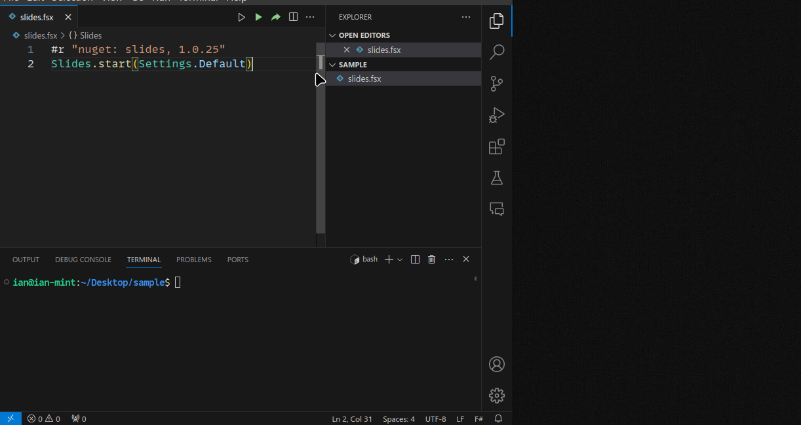

# Instant Markdown slides for the busy man


## Demo



## Features

- zero configuration
- markdown to html slides pipeline
- development server with instant hot-reload
- uses [reveal.js](https://revealjs.com/) under the hood


## Dependencies

[.NET SDK](https://dotnet.microsoft.com/en-us/download) to run the script

## Get started 

- create a `slides.fsx` file with the contents
```fsharp
#r "nuget: slides, 1.0.25"
Slides.start(Settings.Default)
```
- run the script with `dotnet fsi slides.fsx`
- start editing `src/index.md` 
- view the slides at `http://localhost:8080` or from `public/index.html`


## Customization

- you can specify one of the default reveal themes as follows:
```fsharp
#r "nuget: slides, 1.0.25"

Slides.start (
    {
        Settings.Default with
            Theme = Theme.White
            // SourcePath = "path/to/folder"
            // OutPath = "output/directory"
            // Port = 5678
    }
)
```
- for anything more complex either write html in markdown or use something else